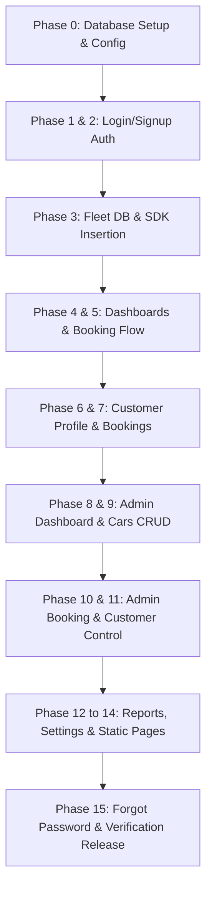

# CHAPTER 2: LITERATURE REVIEW AND PROJECT METHODOLOGY

## 2.1 Introduction
This chapter provides an academic and technical review of the domain, existing technologies, and methodologies relevant to the development of the WeDRIVE car rental system. Section 2.2 reviews existing commercial car rental platforms in Malaysia. Section 2.3 presents a detailed comparison table of these platforms against the proposed WeDRIVE system. Section 2.4 discusses the research on the selected technologies and AI techniques. Section 2.5 explains the project development methodology (Agile Scrum), followed by Section 2.6 which outlines the software and hardware requirements, and Section 2.7 which presents the project schedule.

---

## 2.2 Literature Review on Domain (Existing Platforms)
To establish a benchmark for the proposed WeDRIVE system, three popular car rental and car-sharing platforms operating in Malaysia were analyzed: **SOCAR**, **GoCar**, and **Moovby**.

### 2.2.1 SOCAR Malaysia
SOCAR is a prominent app-based car-sharing platform in Malaysia that allows users to book vehicles hourly, daily, or weekly. 
- **Strengths:** SOCAR has a large fleet of vehicles spread across multiple key urban areas (Kuala Lumpur, Penang, Johor Bahru). The booking process is entirely automated through a mobile app, using Bluetooth-enabled keyless entry for vehicle access.
- **Weaknesses:** The platform is highly dependent on its mobile application, lacking a feature-rich web portal for desktop users. Customer verification is often slow during peak periods. Importantly, SOCAR only displays static, standardized photos of the vehicle model, meaning users cannot visually inspect the physical vehicle's exact body or interior condition before booking.

### 2.2.2 GoCar Malaysia
GoCar is another major car-sharing service in Malaysia offering round-trip and one-way booking configurations.
- **Strengths:** GoCar provides flexible rental durations and has integrated electric vehicles (EVs) into its fleet. It allows bookings via both a web portal and mobile app, offering instant keyless activation.
- **Weaknesses:** The user interface is functional but basic, lacking premium design aesthetics. The calendar booking system does not block pre-booked dates interactively on the calendar dropdown for all cars, sometimes resulting in user confusion. No interactive visual inspection tools are offered, and customer service relies on standard, slow ticketing flows.

### 2.2.3 Moovby
Moovby is a peer-to-peer (P2P) car rental marketplace, often described as the "Airbnb for cars" in Malaysia and Indonesia. It allows private car owners to rent out their idle vehicles to renters.
- **Strengths:** Moovby offers a highly diverse fleet ranging from budget hatchbacks to premium vehicles. It supports booking via a responsive web application.
- **Weaknesses:** Because it is a P2P network, the quality and maintenance of vehicles vary significantly. Visual representations are uploaded by individual owners, often resulting in low-quality, incomplete, or outdated photographs. Moovby does not enforce standard verification checks on vehicle body damage, nor does it support interactive 360-degree inspectable views or automated AI chatbots for local tourist guidance.

---

## 2.3 Comparison and Analysis of Existing Systems
The comparison between the existing systems and the proposed WeDRIVE system is summarized in Table 2.1, highlighting the technological and UI/UX gaps that WeDRIVE aims to close.

**Table 2.1: Comparison of Existing Systems and WeDRIVE**
| System Feature | SOCAR | GoCar | Moovby | WeDRIVE (Proposed) |
| :--- | :--- | :--- | :--- | :--- |
| **Primary Platform** | Mobile App | Mobile App & Web | Mobile App & Web | Desktop & Mobile Web (Vercel) |
| **UI Design Style** | Flat, Corporate | Basic, Standard | Standard Listing | Modern Premium Glassmorphism |
| **360° Virtual Exterior Inspection** | No | No | No | Yes (200-frame interactive rotation) |
| **3D Panorama Interior View** | No | No | No | Yes (Three.js Cubemap rendering) |
| **Calendar Block Integration** | App-based | Standard | Standard | Real-Time DB Sync (Flatpickr) |
| **Verification Workflow** | Mobile document scan | Profile upload | Manual upload | Structured Welcome Splash Redirect |
| **Theme Customization** | Single Mode | Single Mode | Single Mode | Toggleable Day / Night Mode |
| **Language Support** | English only | English only | English & Malay | Dynamic English & Malay Toggle |
| **Integrated AI Chatbot** | No (Static FAQ) | No (Email/Call) | No (Direct Chat) | Yes (Gemini-powered local travel guide) |
| **Database Architecture** | Proprietary Cloud | Proprietary Cloud | Relational DB | Supabase PostgreSQL + Auth + RLS |

---

## 2.4 Research on Selected Technologies and AI Techniques
To build a premium, highly interactive system, WeDRIVE incorporates three distinct technology components:

### 2.4.1 360-Degree Interactive Inspection Viewer
To resolve disputes over vehicle damage, WeDRIVE implements a web-based interactive viewer. 
- **Exterior Viewer:** Rather than rendering heavy 3D CAD models which increase latency on mobile devices, WeDRIVE uses frame interpolation. Each vehicle is photographed at 200 distinct angles. When a user drags or swipes across the vehicle display, the system dynamically calculates the mouse/touch displacement and updates the source image path sequentially (`frame-000.jpg` to `frame-199.jpg`). This provides a smooth, low-latency 360-degree rotation.
- **Interior Viewer:** To render the car's interior, the system utilizes **Three.js** (a lightweight WebGL library). The cabin interior is mapped onto a 3D cubemap consisting of 6 distinct faces (front, back, left, right, up, down). The user can pan, tilt, and zoom using mouse controls, providing an immersive, walk-in visual experience.

### 2.4.2 Serverless BaaS and Real-Time Sync (Supabase & PostgreSQL)
Migrating from static JSON files to a live cloud database is achieved using **Supabase**, an open-source Firebase alternative built on top of **PostgreSQL**.
- **Supabase Auth:** Manages logins and signups securely using bcrypt hash algorithms. It supports both credentials-based authentication and Google OAuth 2.0.
- **Row Level Security (RLS):** Policies are enforced at the database level to ensure that customers can only read and write their own bookings, while admins retain global write/read access.
- **Dynamic Date Blocking:** Flatpickr is configured to run an asynchronous PostgreSQL query on the `bookings` table whenever a vehicle is selected. It fetches all booking ranges where `car_id` matches the selection and the status is active. These ranges are dynamically fed into the calendar API to disable selection, preventing double-bookings.

### 2.4.3 Large Language Model (LLM) Integration for Chatbot
The system incorporates a responsive client chatbot in the UI. 
- **AI Chatbot:** The chatbot uses a Large Language Model API (such as Google Gemini) to process user queries. It is supplied with system guidelines and local tourism context in Melaka (places of interest, culinary hotspots, transport rules). The chatbot runs directly on the client side, retrieving settings and keys securely. 

---

## 2.5 Project Development Methodology
This project utilizes the **Agile Scrum Methodology**, which is highly suited for fast-paced web development requiring frequent iterations and progressive integrations. The development of WeDRIVE is structured into sequential phases (or "sprints") that build upon a core foundation.

### 2.5.1 Progressive Sprint Breakdown
1. **Sprint 1 (Foundations & Auth):** Provisioned the Supabase project, configured Google OAuth, implemented the login/signup interfaces, and structured the `admins` and `customers` tables.
2. **Sprint 2 (Core Customer Flow):** Created the `cars` and `bookings` tables. Integrated the Supabase JS SDK across the client dashboard, car details, and booking checkouts. Implemented the Flatpickr date-blocking logic.
3. **Sprint 3 (User Profile & Verification):** Developed the custom profile verification splash redirect. Enforced country-code selectors and formatting checks for phone numbers.
4. **Sprint 4 (Admin Panel & Management):** Built the admin dashboard, replacing native alert boxes with receipt-style modals. Implemented sorting, search filters, and date range options on the bookings list.
5. **Sprint 5 (System Tuning & Deployment):** Completed the reports generator, settings managers, forgot-password wizard, and sitemap layout. Validated the final build on Vercel.

---

## 2.6 Software and Hardware Requirements
The system was developed and tested using the following configurations:

### 2.6.1 Software Requirements
- **Operating System:** macOS / Windows 11
- **Development Tool:** Visual Studio Code (VS Code)
- **Programming Languages:** HTML5, CSS3 (Custom Glassmorphism), Javascript (ES6)
- **Database & Backend Services:** Supabase BaaS (PostgreSQL, Supabase Auth, Row Level Security, Storage)
- **Libraries & APIs:** Three.js (3D Interior Render), Flatpickr (Calendar), Anime.js (Micro-interactions), Google Gemini API (Chatbot)
- **Hosting Platform:** Vercel (Auto-deployment pipeline via GitHub)
- **Version Control:** Git & GitHub

### 2.6.2 Hardware Requirements
- **Development Workstation:** Apple Macbook Pro (Apple M-series Silicon, 16GB RAM, 512GB SSD) or compatible Intel/AMD workstation.
- **Testing Devices:** 
  - Desktop Monitor (1440x900, 1920x1080 resolution)
  - Tablet Portrait/Landscape (iPad emulator)
  - Mobile Phones (iPhone 14 Pro, Samsung Galaxy S23 for responsive viewport validation)

---

## 2.7 Project Schedule and Milestones
The project schedule is structured in a tabular Gantt format, tracking the progressive sprints from inception to final deployment (from March 2026 to June 2026).

**Table 2.2: Project Schedule and Milestones**
| Phase | Task / Milestone Name | Expected Deliverable | Start Date | End Date | Status |
| :--- | :--- | :--- | :--- | :--- | :--- |
| **Phase 0** | Database & Project Initialization | Supabase workspace, `api.js` structure | 06 Mar 2026 | 21 Mar 2026 | Completed |
| **Phase 1** | Authentication & Google OAuth | Login UI, email/pass auth, Google callback | 22 Mar 2026 | 05 Apr 2026 | Completed |
| **Phase 2** | Signup Flow & Customer Creation | Signup UI, `customers` database table | 06 Apr 2026 | 15 Apr 2026 | Completed |
| **Phase 3** | Fleet Integration & SDK Setup | `cars` database table, global SDK imports | 16 Apr 2026 | 25 Apr 2026 | Completed |
| **Phase 4** | Booking Flow & Date Blocking | `bookings` table, Flatpickr calendar logic | 26 Apr 2026 | 10 May 2026 | Completed |
| **Phase 5** | Customer Dashboards & Profiles | My Bookings UI, Profile Verification workflow | 11 May 2026 | 20 May 2026 | Completed |
| **Phase 6** | Admin Dashboard & Fleet CRUD | Admin portal, Cars list manager, Add/Edit modal | 21 May 2026 | 02 Jun 2026 | Completed |
| **Phase 7** | Admin Bookings & Customer Control | Customer block toggle, receipt details modal | 03 Jun 2026 | 12 Jun 2026 | Completed |
| **Phase 8** | Analytical Reports & Settings | Charts generation, configurations panel | 13 Jun 2026 | 18 Jun 2026 | Completed |
| **Phase 9** | Deployment, Testing & Verification | Live site on Vercel, responsive validation | 19 Jun 2026 | 22 Jun 2026 | Completed |

---

## 2.8 Conclusion
This chapter has established the theoretical and methodological framework for WeDRIVE. By comparing existing car rental solutions, the analysis highlighted the demand for 360-degree virtual inspections, secure profile verification, and integrated AI travel support. The selection of Agile Scrum methodology, combined with the detailed hardware and software specifications, has guided the implementation steps. The next chapter will focus on the detailed system analysis, outlining the database schema designs, use cases, and functional requirements.
