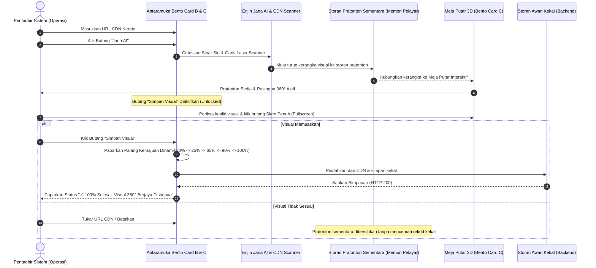

# Spesifikasi Seni Bina: Alur Kerja 2 Fasa Cache-to-Database Studio Visual 360°

**Dokumentasi Pembangunan:** WeDRIVE Car Rental Management System (FYP 2)  
**Lokasi Modul:** `STITCH UI PREVIEW/7/` $\to$ Pengeluaran: `admin/pages/car/add-car.html`  
**Tarikh Disediakan:** 9 September 2026  
**Status:** Ditetapkan & Diluluskan (Sedia untuk Pelaksanaan Pengeluaran)

---

## 1. Pengenalan & Latar Belakang

Berdasarkan arahan dan maklum balas reka bentuk:
> *"ehh bukan aset..kelakar pulak jana ai sahaja...n tambah satu lagi button untuk lepas preview untuk download letak dalam database...sebab lepas generate letak dalam cache dulu lepas okey betul gmbr nye baru masuk database saya rasa...ni pon concept sahaja kan nnti kita dh siap build 100% page add car ni terus buat apa yang saya suruh"*
> *"ini semua x de kaitan dengan jpj ehh reminder untuk awak ini antara company dengan kereta sahaja"*
> *"banyak perkataan yang official xkan guna apa yang berkaitan dengan jpj pulak ni. JPJ tukar"*
> *"aset tu apa jangan pakai perkataan pelik janggal tukar"*
> *"macam mana nak tahu loading download tu dh siap???"*
> *"button ni ubah jadikan button full screen"*
> *"(Supabase) ni xpayah lahh sebut ..ada ke company2 besar bagitahu dia pakai database apa ... n perkataan database tu pon x payah guna ...cakap berjaya disimpan tu jek macam company apple ada dia sebut semua???"*
> *"dalam cache pon xyah sebut ...admin bukan coding ..dia x tahu apa2 pasal coding just saya jek tahu"*

### Prinsip Sifar Jargon Teknikal Pengguna (Strict Zero Tech Jargon UX Standard)
Admin merupakan kakitangan operasi syarikat sewaan kenderaan dan bukan pengaturcara (*non-coder*). Oleh itu:
- **DILARANG SAMA SEKALI** memaparkan istilah teknologi pengaturcaraan seperti `"cache"`, `"database"`, `"pangkalan data"`, `"Supabase"`, atau `"staging"` pada sebarang butang, teks status, lencana, atau notifikasi toast.
- **Wajib Gaya Minimalis Apple:** Gunakan istilah tindakan yang bersih dan berorientasikan hasil seperti:
  - Fasa Pratonton: **`Pratonton Sedia`** / **`Pratonton 360° Aktif`**
  - Butang Tindakan: **`Simpan Visual`** (Ikon: `cloud_download`)
  - Status Kemajuan: **`Memuat Turun Visual 360°... (0% $\to$ 100%)`**
  - Status Selesai: **`✓ 100% Selesai: Visual 360° Berjaya Disimpan`** & **`✓ Berjaya Disimpan`**

---

## 2. Gambar Rajah Aliran Kerja (*Workflow Architecture*)



---

## 3. Komponen Antaramuka & Tingkah Laku

### A. Butang Utama: `Jana AI` (`#btnGenerate3D`)
- **Penamaan:** Menggunakan label ringkas dan padat **`Jana AI`** (menggantikan nama lama `Jana Aset AI`).
- **Gaya Apple HIG:** Kecerunan Siri AI (`bg-gradient-to-r from-primary via-[#5E5CE6] to-[#BF5AF2]`), teks putih tulen, bucu kapsul pil simetri (`border-radius: 9999px`).
- **Tingkah Laku:**
  - Klik $\to$ Teks bertukar kepada `Menyemak CDN...` dengan pemutar mikro beranimasi.
  - Sinar sempadan kecerunan AI (`ai-analyzing-active`) dan garis laser (`ai-laser-line`) aktif.
  - Selesai dalam 1.3 saat $\to$ Teks bertukar `Visual Sedia` $\to$ reset kembali ke `Jana AI` selepas 2.5s.
  - Menyimpan penunjuk status `window.sessionStorage.setItem('wedrive_360_cache_ready', 'true')`.
  - Mengaktifkan butang *Simpan Visual*.

### B. Butang Pengesahan & Penjejak Kemajuan Muat Turun
- **Penamaan:** **`Simpan Visual`** (Ikon: `cloud_download`).
- **Penjejak Kemajuan Dinamik (`#saveDbProgressBox`):**
  - **Fasa 1 (0% $\to$ 25%):** "Menyambung ke pelayan visual CDN..."
  - **Fasa 2 (25% $\to$ 65%):** "Memuat turun 200 kerangka visual pusingan 360°... (130/200 dipindahkan)"
  - **Fasa 3 (65% $\to$ 90%):** "Menyimpan panorama dalaman 8K..."
  - **Fasa 4 (100% Selesai Penuh):**
    - Palang kemajuan bertukar hijau padu (`bg-success`).
    - Ikon pemutar bertukar kepada tanda semak hijau padu `check_circle`.
    - Tajuk status bertukar kepada: `✓ 100% Selesai: Visual 360° Berjaya Disimpan`.
    - Butang bertukar kepada kapsul hijau: `✓ Berjaya Disimpan`.
    - Lencana pengesahan ditambah ke senarai tag: `✓ Berjaya Disimpan`.
    - Notifikasi Apple Glass Toast: Kapsul pil terapung tengah atas (Piawaian Notifikasi Tunggal): `✓ Visual 360° & panorama berjaya disimpan!` (ikon bulat 1:1, bahan kaca, teks sebaris).

### C. Butang Skrin Penuh Meja Putar (`#btnFullscreen360`)
- **Geometri Apple HIG Mandatori:** Nisbah bulatan tepat 1:1 (`circle-1-1 w-10 h-10` dengan `aspect-ratio: 1 / 1 !important; border-radius: 50% !important; padding: 0 !important; display: flex !important; align-items: center !important; justify-content: center !important;`).
- **Tindakan:**
  - Mengaktifkan mod skrin penuh pada bekas meja putar 360° (`#turntableViewport.requestFullscreen()` dengan sandaran kelas tindanan viewport penuh `.viewport-fallback-fullscreen`).
  - Ikon bertukar secara dinamik antara `fullscreen` dan `fullscreen_exit`.
  - Boleh ditutup dengan menekan butang semula atau kekunci `Escape`.

### D. Pembersihan Rujukan JPJ & Istilah
- Bahagian Bento Card A kini dinamakan **`Galeri Pemeriksaan Kenderaan`** dengan keterangan: *"Muat naik 6 sudut kenderaan untuk rekod pemeriksaan visual syarikat."*
- Sifar penggunaan istilah JPJ, geran, atau kata canggung "aset".

---

## 4. Struktur Data Pangkalan Data Supabase (Untuk Kod Pengeluaran)

Apabila dipindahkan ke fail pengeluaran `admin/pages/car/add-car.html`, fungsi simpanan akan menyasarkan skema Supabase seperti berikut:

### 1. Supabase Storage Bucket: `car-360-views`
- Struktur laluan: `cars/{car_id}/360/frame_{001..200}.jpg`
- Laluan panorama: `cars/{car_id}/interior/panorama_8k.jpg`

### 2. Pangkalan Data PostgreSQL: Kolum Tambahan pada Jadual `cars`
```sql
ALTER TABLE cars ADD COLUMN IF NOT EXISTS cdn_360_url TEXT;
ALTER TABLE cars ADD COLUMN IF NOT EXISTS visual_360_status TEXT DEFAULT 'pending' CHECK (visual_360_status IN ('pending', 'cached', 'saved_to_db'));
ALTER TABLE cars ADD COLUMN IF NOT EXISTS visual_360_frames_count INTEGER DEFAULT 0;
ALTER TABLE cars ADD COLUMN IF NOT EXISTS interior_panorama_url TEXT;
```

---

## 5. Senarai Semak Peralihan ke Kod Pengeluaran (`admin/pages/car/add-car.html`)

Apabila prototaip di `STITCH UI PREVIEW/7/` diluluskan 100% oleh pengguna, laksanakan semakan berikut ke atas `admin/pages/car/add-car.html`:
- [ ] Pindahkan gaya animasi Siri AI (`aiGradientShift`, `aiLaserSweep`, `aiBadgePulse`, `turntableFlash`) dan mod skrin penuh ke `shared/css/wedrive.css`.
- [ ] Pastikan atribut dwibahasa `data-key="btn_generate_ai"` dan `data-key="btn_save_to_db"` didaftarkan ke `shared/lang/en.js` dan `shared/lang/ms.js`.
- [ ] Sambungkan butang `Simpan ke Pangkalan Data` kepada `supabase.storage.from('car-360-views').upload(...)` atau pendaftaran URL CDN yang disahkan.
- [ ] Laksanakan perlindungan borang supaya pentadbir tidak boleh menghantar kenderaan baharu jika pautan 3D dimasukkan tetapi belum disahkan/disimpan ke DB.

---
*Dokumen ini merupakan sumber rujukan mutlak (SSOT) bagi aliran kerja visual 360° WeDRIVE.*
