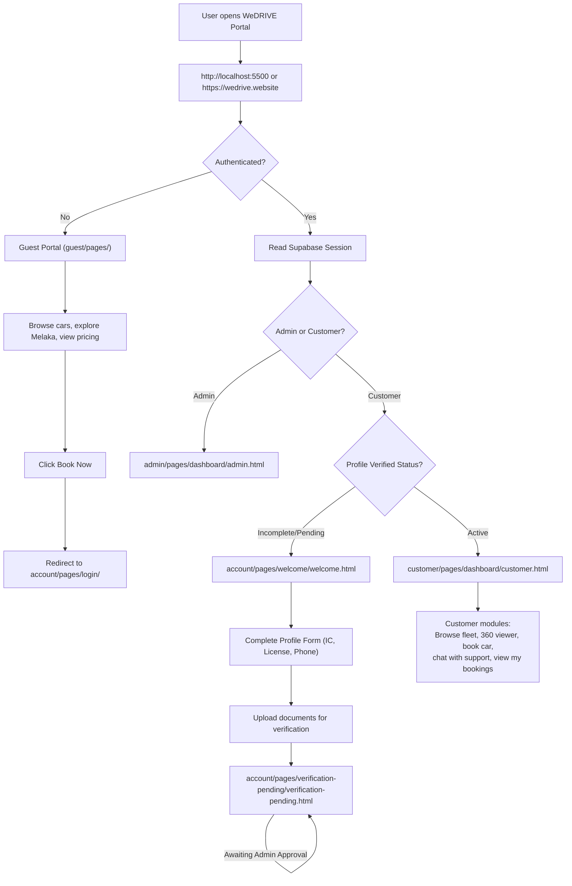
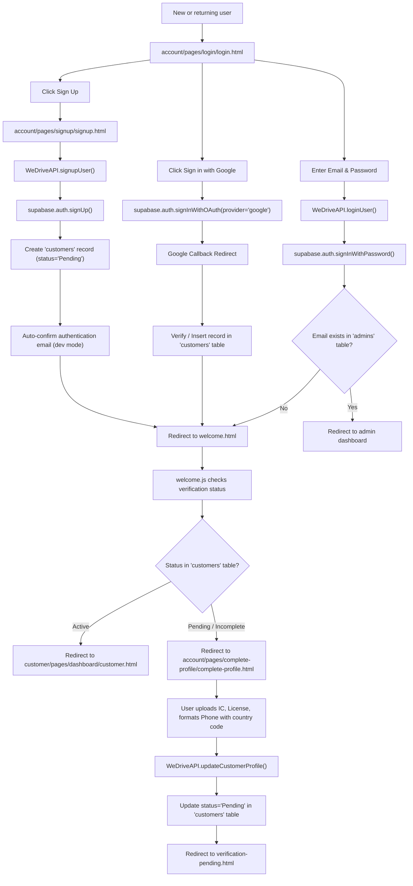
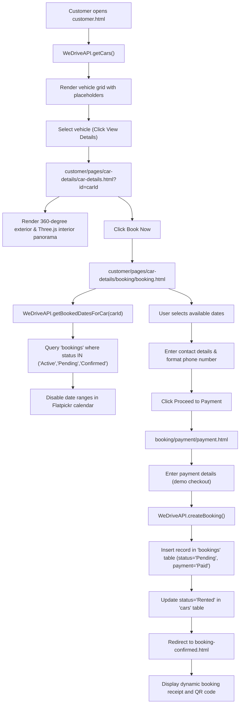
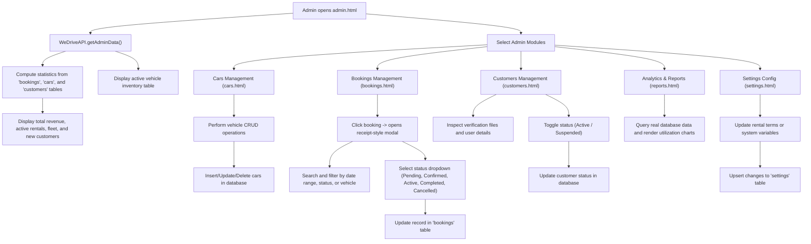
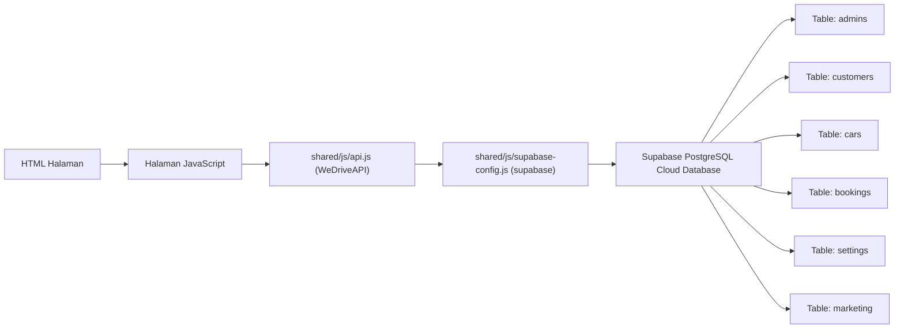

# WeDRIVE Full System Flowchart

This file describes the complete operational flow of the WeDRIVE system. The diagrams are structured using Mermaid syntax and represent the actual, active implementation of the system using Supabase PostgreSQL, Authentication, and dynamic layouts.

---

## 1. Overall System Architecture

---

## 2. Authentication and Profile Verification Flow

This flow details how users register, authenticate via Email or Google OAuth, and proceed through the profile verification compliance gate.

---

## 3. Customer Booking and Calendar Blocking Flow

---

## 4. Admin Management and Real-Time Dashboard Flow

---

## 5. Unified Database Integration Architecture

The following diagram illustrates how the frontend components are decoupled from direct query calls, routing all operations through a unified API layer.

