# WeDRIVE Full System Flowchart

Fail ini menerangkan flow penuh sistem WeDRIVE dalam satu tempat. Format flowchart menggunakan Mermaid, jadi ia boleh dibaca terus sebagai teks atau dirender sebagai diagram dalam editor yang support Mermaid.

## 1. Gambaran Keseluruhan Sistem

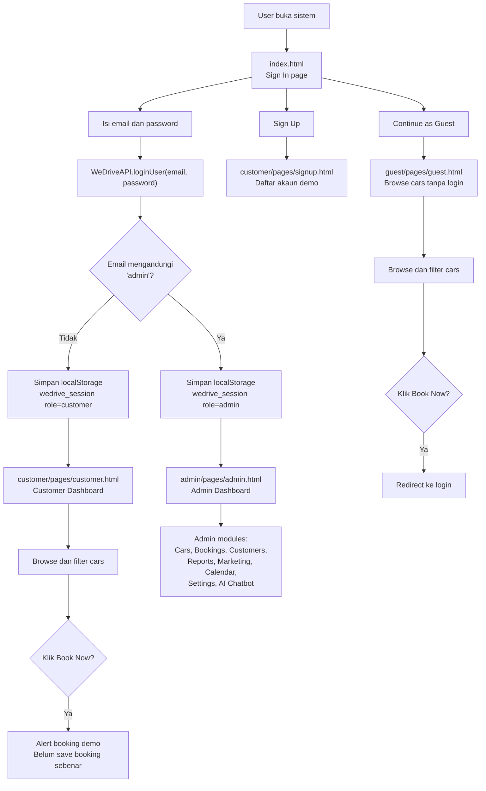
```mermaid
flowchart TD
    START["User buka sistem"] --> LOGIN["index.html<br/>Sign In page"]

    LOGIN --> GUEST_BTN["Continue as Guest"]
    LOGIN --> SIGNUP_BTN["Sign Up"]
    LOGIN --> LOGIN_FORM["Isi email dan password"]

    GUEST_BTN --> GUEST_PAGE["guest/pages/guest.html<br/>Browse cars tanpa login"]
    SIGNUP_BTN --> SIGNUP_PAGE["customer/pages/signup.html<br/>Daftar akaun demo"]

    LOGIN_FORM --> API_LOGIN["WeDriveAPI.loginUser(email, password)"]
    API_LOGIN --> ROLE_CHECK{"Email mengandungi<br/>'admin'?"}

    ROLE_CHECK -->|Ya| ADMIN_SESSION["Simpan localStorage<br/>wedrive_session role=admin"]
    ROLE_CHECK -->|Tidak| CUSTOMER_SESSION["Simpan localStorage<br/>wedrive_session role=customer"]

    ADMIN_SESSION --> ADMIN_DASH["admin/pages/admin.html<br/>Admin Dashboard"]
    CUSTOMER_SESSION --> CUSTOMER_DASH["customer/pages/customer.html<br/>Customer Dashboard"]

    GUEST_PAGE --> GUEST_BROWSE["Browse dan filter cars"]
    GUEST_BROWSE --> GUEST_BOOK{"Klik Book Now?"}
    GUEST_BOOK -->|Ya| BACK_LOGIN["Redirect ke login"]

    CUSTOMER_DASH --> CUSTOMER_BROWSE["Browse dan filter cars"]
    CUSTOMER_BROWSE --> CUSTOMER_BOOK{"Klik Book Now?"}
    CUSTOMER_BOOK -->|Ya| BOOKING_ALERT["Alert booking demo<br/>Belum save booking sebenar"]

    ADMIN_DASH --> ADMIN_MODULES["Admin modules:<br/>Cars, Bookings, Customers,<br/>Reports, Marketing, Calendar,<br/>Settings, AI Chatbot"]
```

## 2. Struktur Data dan API Flow

Sistem sekarang belum guna backend sebenar. Semua data utama datang daripada `shared/dummy/data.json`. Fail `shared/js/api.js` bertindak sebagai pusat API supaya nanti mudah tukar ke database sebenar.

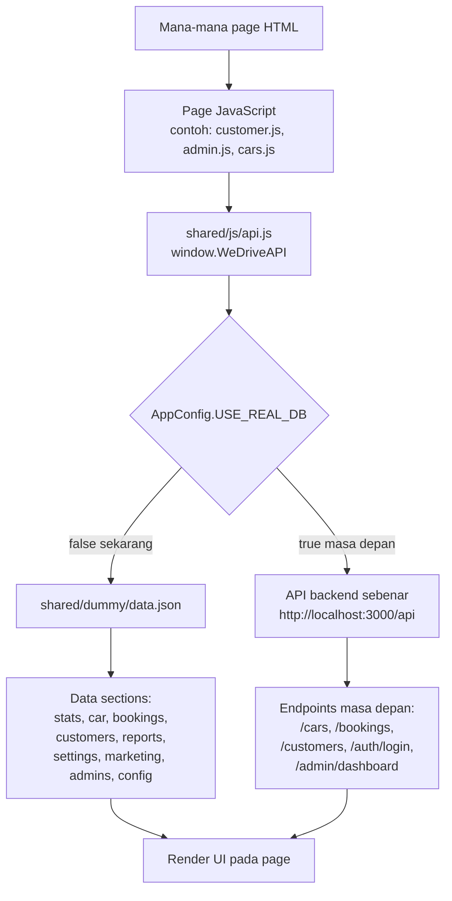
```mermaid
flowchart TD
    PAGE["Mana-mana page HTML"] --> PAGE_JS["Page JavaScript<br/>contoh: customer.js, admin.js, cars.js"]
    PAGE_JS --> API["shared/js/api.js<br/>window.WeDriveAPI"]

    API --> DB_SWITCH{"AppConfig.USE_REAL_DB"}

    DB_SWITCH -->|false sekarang| DUMMY["shared/dummy/data.json"]
    DB_SWITCH -->|true masa depan| BACKEND["API backend sebenar<br/>http://localhost:3000/api"]

    DUMMY --> DATA_SECTIONS["Data sections:<br/>stats, car, bookings,<br/>customers, reports,<br/>settings, marketing, admins, config"]
    BACKEND --> ENDPOINTS["Endpoints masa depan:<br/>/cars, /bookings,<br/>/customers, /auth/login,<br/>/admin/dashboard"]

    DATA_SECTIONS --> RENDER["Render UI pada page"]
    ENDPOINTS --> RENDER
```

### Data utama dalam `data.json`

| Section | Fungsi |
|---|---|
| `stats` | Nombor ringkas untuk dashboard admin |
| `car` | Senarai kereta, status, harga, spesifikasi, gambar |
| `bookings` | Senarai tempahan customer |
| `customers` | Senarai pelanggan |
| `reports` | Revenue bulanan, utilization kereta, summary report |
| `settings` | Maklumat syarikat, cukai, deposit, lokasi pickup |
| `marketing` | Banner, promo code, seasonal pricing |
| `admins` / `config` | Data sokongan untuk demo/config |

## 3. Login dan Session Flow

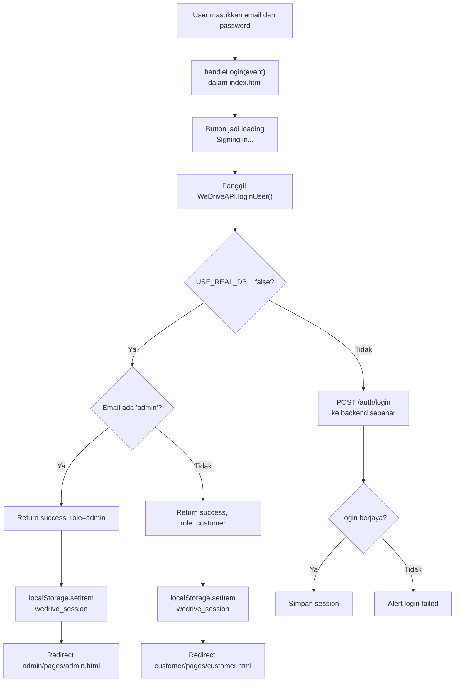
```mermaid
flowchart TD
    USER["User masukkan email dan password"] --> HANDLE_LOGIN["handleLogin(event)<br/>dalam index.html"]
    HANDLE_LOGIN --> DISABLE_BTN["Button jadi loading<br/>Signing in..."]
    DISABLE_BTN --> CALL_API["Panggil WeDriveAPI.loginUser()"]

    CALL_API --> USE_DUMMY{"USE_REAL_DB = false?"}
    USE_DUMMY -->|Ya| CHECK_EMAIL{"Email ada 'admin'?"}
    USE_DUMMY -->|Tidak| REAL_LOGIN["POST /auth/login<br/>ke backend sebenar"]

    CHECK_EMAIL -->|Ya| ADMIN_ROLE["Return success, role=admin"]
    CHECK_EMAIL -->|Tidak| CUSTOMER_ROLE["Return success, role=customer"]

    ADMIN_ROLE --> SAVE_ADMIN["localStorage.setItem<br/>wedrive_session"]
    CUSTOMER_ROLE --> SAVE_CUSTOMER["localStorage.setItem<br/>wedrive_session"]

    SAVE_ADMIN --> GO_ADMIN["Redirect admin/pages/admin.html"]
    SAVE_CUSTOMER --> GO_CUSTOMER["Redirect customer/pages/customer.html"]

    REAL_LOGIN --> REAL_RESULT{"Login berjaya?"}
    REAL_RESULT -->|Ya| SAVE_REAL_SESSION["Simpan session"]
    REAL_RESULT -->|Tidak| LOGIN_FAILED["Alert login failed"]
```

### Nota penting auth

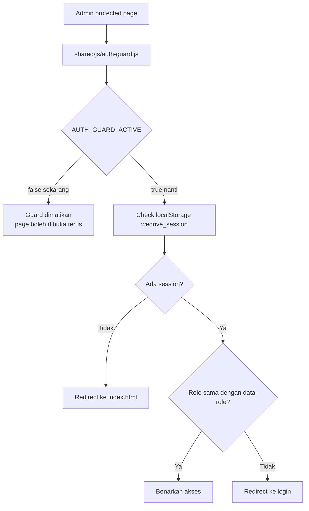
```mermaid
flowchart TD
    PROTECTED_PAGE["Admin protected page"] --> AUTH_GUARD["shared/js/auth-guard.js"]
    AUTH_GUARD --> ACTIVE_CHECK{"AUTH_GUARD_ACTIVE"}
    ACTIVE_CHECK -->|false sekarang| SKIP["Guard dimatikan<br/>page boleh dibuka terus"]
    ACTIVE_CHECK -->|true nanti| CHECK_SESSION["Check localStorage wedrive_session"]
    CHECK_SESSION --> HAS_SESSION{"Ada session?"}
    HAS_SESSION -->|Tidak| REDIRECT_LOGIN["Redirect ke index.html"]
    HAS_SESSION -->|Ya| ROLE_MATCH{"Role sama dengan data-role?"}
    ROLE_MATCH -->|Ya| ALLOW["Benarkan akses"]
    ROLE_MATCH -->|Tidak| DENY["Redirect ke login"]
```

## 4. Guest Flow

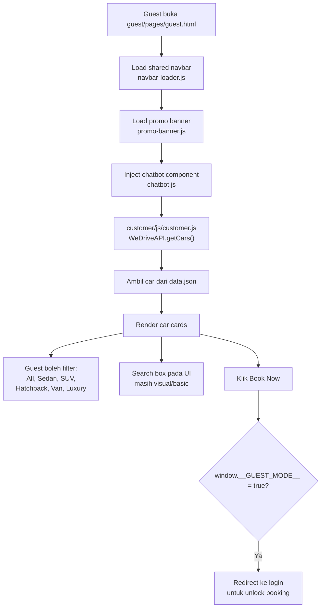
```mermaid
flowchart TD
    GUEST_START["Guest buka guest/pages/guest.html"] --> LOAD_NAV["Load shared navbar<br/>navbar-loader.js"]
    LOAD_NAV --> LOAD_PROMO["Load promo banner<br/>promo-banner.js"]
    LOAD_PROMO --> LOAD_CHATBOT["Inject chatbot component<br/>chatbot.js"]
    LOAD_CHATBOT --> LOAD_CARS["customer/js/customer.js<br/>WeDriveAPI.getCars()"]
    LOAD_CARS --> DATA_JSON["Ambil car dari data.json"]
    DATA_JSON --> RENDER_CARS["Render car cards"]

    RENDER_CARS --> FILTER["Guest boleh filter:<br/>All, Sedan, SUV,<br/>Hatchback, Van, Luxury"]
    RENDER_CARS --> SEARCH_BOX["Search box pada UI<br/>masih visual/basic"]
    RENDER_CARS --> BOOK_CLICK["Klik Book Now"]

    BOOK_CLICK --> GUEST_MODE{"window.__GUEST_MODE__ = true?"}
    GUEST_MODE -->|Ya| GO_LOGIN["Redirect ke login<br/>untuk unlock booking"]
```

## 5. Customer Flow

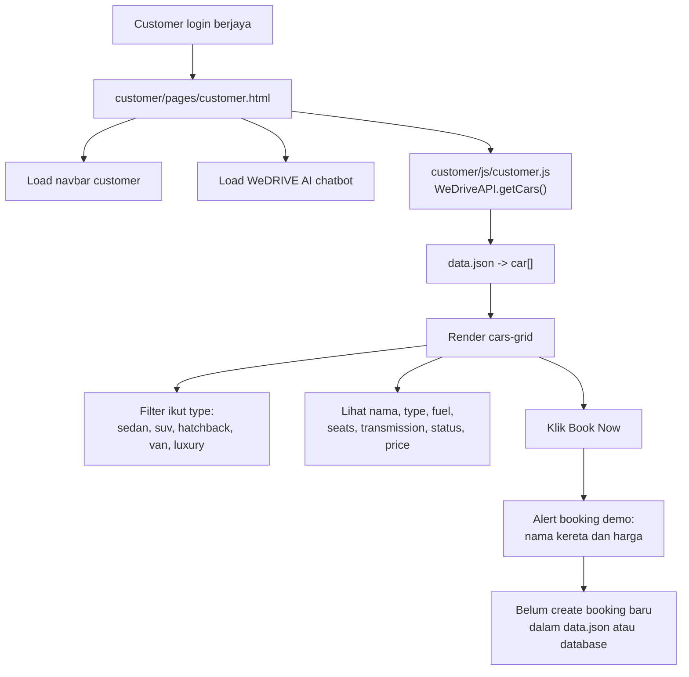
```mermaid
flowchart TD
    CUSTOMER_START["Customer login berjaya"] --> CUSTOMER_PAGE["customer/pages/customer.html"]
    CUSTOMER_PAGE --> LOAD_NAV["Load navbar customer"]
    CUSTOMER_PAGE --> LOAD_CHATBOT["Load WeDRIVE AI chatbot"]
    CUSTOMER_PAGE --> LOAD_CARS["customer/js/customer.js<br/>WeDriveAPI.getCars()"]

    LOAD_CARS --> CAR_DATA["data.json -> car[]"]
    CAR_DATA --> CAR_GRID["Render cars-grid"]

    CAR_GRID --> FILTER_TYPE["Filter ikut type:<br/>sedan, suv, hatchback, van, luxury"]
    CAR_GRID --> VIEW_CARD["Lihat nama, type, fuel,<br/>seats, transmission, status, price"]
    CAR_GRID --> BOOK_NOW["Klik Book Now"]

    BOOK_NOW --> BOOK_DEMO["Alert booking demo:<br/>nama kereta dan harga"]
    BOOK_DEMO --> LIMITATION["Belum create booking baru<br/>dalam data.json atau database"]
```

## 6. Admin Main Dashboard Flow

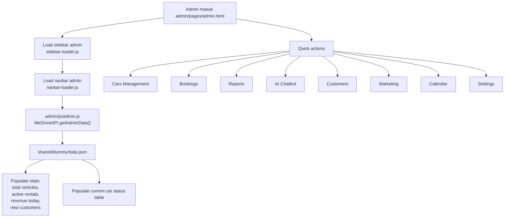
```mermaid
flowchart TD
    ADMIN_START["Admin masuk admin/pages/admin.html"] --> LOAD_SIDEBAR["Load sidebar admin<br/>sidebar-loader.js"]
    LOAD_SIDEBAR --> LOAD_NAVBAR["Load navbar admin<br/>navbar-loader.js"]
    LOAD_NAVBAR --> LOAD_ADMIN_DATA["admin/js/admin.js<br/>WeDriveAPI.getAdminData()"]

    LOAD_ADMIN_DATA --> DATA_JSON["shared/dummy/data.json"]
    DATA_JSON --> STATS["Populate stats:<br/>total vehicles,<br/>active rentals,<br/>revenue today,<br/>new customers"]
    DATA_JSON --> CAR_TABLE["Populate current car status table"]

    ADMIN_START --> QUICK_ACTIONS["Quick actions"]
    QUICK_ACTIONS --> CARS["Cars Management"]
    QUICK_ACTIONS --> BOOKINGS["Bookings"]
    QUICK_ACTIONS --> REPORTS["Reports"]
    QUICK_ACTIONS --> CHATBOT["AI Chatbot"]
    QUICK_ACTIONS --> CUSTOMERS["Customers"]
    QUICK_ACTIONS --> MARKETING["Marketing"]
    QUICK_ACTIONS --> CALENDAR["Calendar"]
    QUICK_ACTIONS --> SETTINGS["Settings"]
```

## 7. Admin Cars/Car Flow

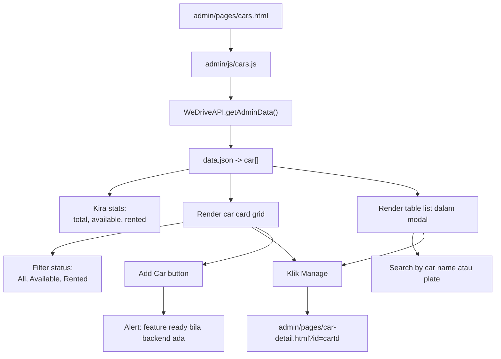
```mermaid
flowchart TD
    CARS_PAGE["admin/pages/cars.html"] --> CARS_JS["admin/js/cars.js"]
    CARS_JS --> LOAD_DATA["WeDriveAPI.getAdminData()"]
    LOAD_DATA --> CAR["data.json -> car[]"]

    CAR --> STATS["Kira stats:<br/>total, available, rented"]
    CAR --> CARD_VIEW["Render car card grid"]
    CAR --> TABLE_VIEW["Render table list dalam modal"]

    CARD_VIEW --> FILTER["Filter status:<br/>All, Available, Rented"]
    TABLE_VIEW --> SEARCH["Search by car name atau plate"]
    CARD_VIEW --> MANAGE["Klik Manage"]
    TABLE_VIEW --> MANAGE

    MANAGE --> DETAIL_PAGE["admin/pages/car-detail.html?id=carId"]
    CARD_VIEW --> ADD_CAR["Add Car button"]
    ADD_CAR --> DEMO_ALERT["Alert: feature ready bila backend ada"]
```

## 8. Admin Car Detail dan Booking Calendar Flow

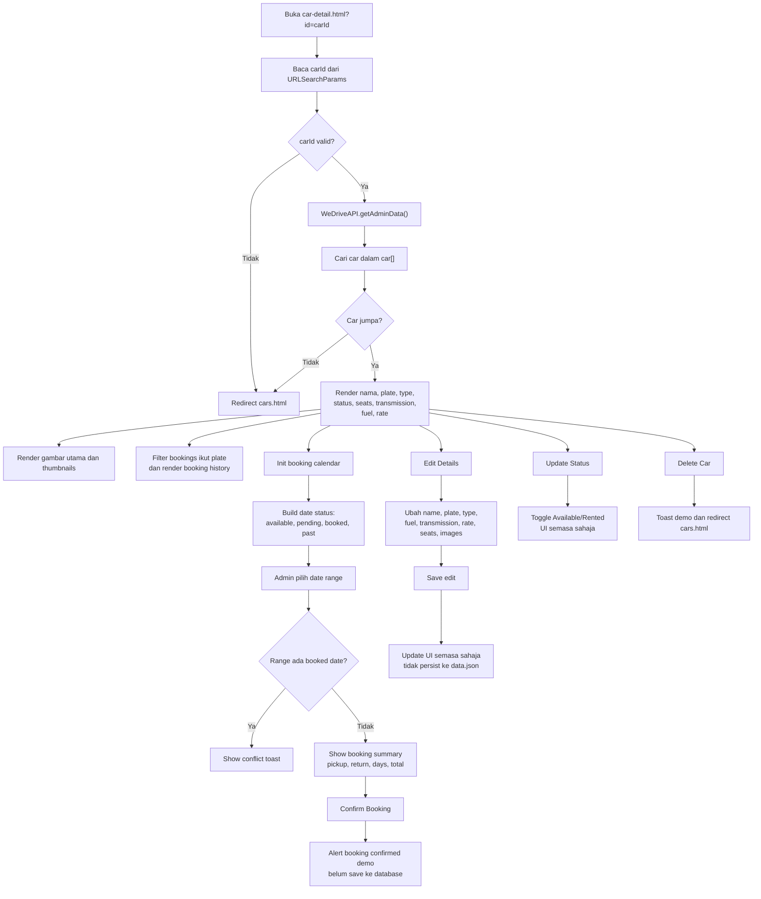
```mermaid
flowchart TD
    DETAIL_START["Buka car-detail.html?id=carId"] --> READ_ID["Baca carId dari URLSearchParams"]
    READ_ID --> VALID_ID{"carId valid?"}
    VALID_ID -->|Tidak| BACK_CARS["Redirect cars.html"]
    VALID_ID -->|Ya| LOAD_DATA["WeDriveAPI.getAdminData()"]

    LOAD_DATA --> FIND_CAR["Cari car dalam car[]"]
    FIND_CAR --> FOUND{"Car jumpa?"}
    FOUND -->|Tidak| BACK_CARS
    FOUND -->|Ya| RENDER_DETAIL["Render nama, plate, type,<br/>status, seats, transmission,<br/>fuel, rate"]

    RENDER_DETAIL --> RENDER_IMAGES["Render gambar utama dan thumbnails"]
    RENDER_DETAIL --> HISTORY["Filter bookings ikut plate<br/>dan render booking history"]
    RENDER_DETAIL --> CALENDAR["Init booking calendar"]

    CALENDAR --> DATE_STATUS["Build date status:<br/>available, pending, booked, past"]
    DATE_STATUS --> SELECT_DATE["Admin pilih date range"]
    SELECT_DATE --> CONFLICT{"Range ada booked date?"}
    CONFLICT -->|Ya| SHOW_TOAST["Show conflict toast"]
    CONFLICT -->|Tidak| SUMMARY["Show booking summary<br/>pickup, return, days, total"]
    SUMMARY --> CONFIRM["Confirm Booking"]
    CONFIRM --> DEMO_BOOKING["Alert booking confirmed demo<br/>belum save ke database"]

    RENDER_DETAIL --> EDIT["Edit Details"]
    EDIT --> EDIT_FORM["Ubah name, plate, type,<br/>fuel, transmission, rate, seats, images"]
    EDIT_FORM --> SAVE_EDIT["Save edit"]
    SAVE_EDIT --> UPDATE_SCREEN["Update UI semasa sahaja<br/>tidak persist ke data.json"]

    RENDER_DETAIL --> UPDATE_STATUS["Update Status"]
    UPDATE_STATUS --> TOGGLE_STATUS["Toggle Available/Rented<br/>UI semasa sahaja"]

    RENDER_DETAIL --> DELETE_CAR["Delete Car"]
    DELETE_CAR --> DEMO_DELETE["Toast demo dan redirect cars.html"]
```

## 9. Admin Bookings Flow

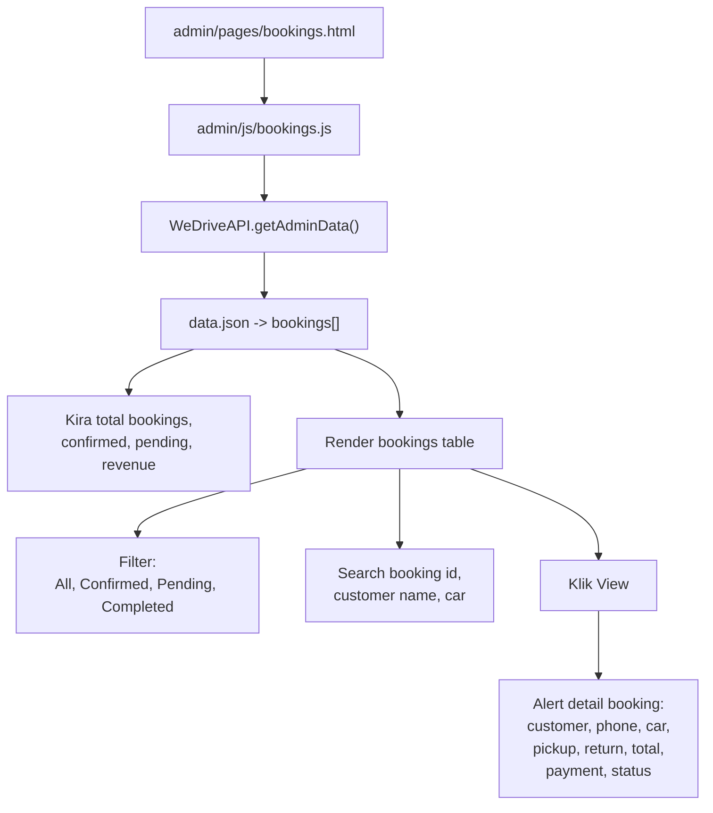
```mermaid
flowchart TD
    BOOKINGS_PAGE["admin/pages/bookings.html"] --> BOOKINGS_JS["admin/js/bookings.js"]
    BOOKINGS_JS --> LOAD_DATA["WeDriveAPI.getAdminData()"]
    LOAD_DATA --> BOOKINGS_DATA["data.json -> bookings[]"]

    BOOKINGS_DATA --> STATS["Kira total bookings,<br/>confirmed, pending, revenue"]
    BOOKINGS_DATA --> TABLE["Render bookings table"]

    TABLE --> FILTER_STATUS["Filter:<br/>All, Confirmed, Pending, Completed"]
    TABLE --> SEARCH["Search booking id,<br/>customer name, car"]
    TABLE --> VIEW["Klik View"]
    VIEW --> ALERT_DETAIL["Alert detail booking:<br/>customer, phone, car,<br/>pickup, return, total,<br/>payment, status"]
```

## 10. Admin Customers Flow

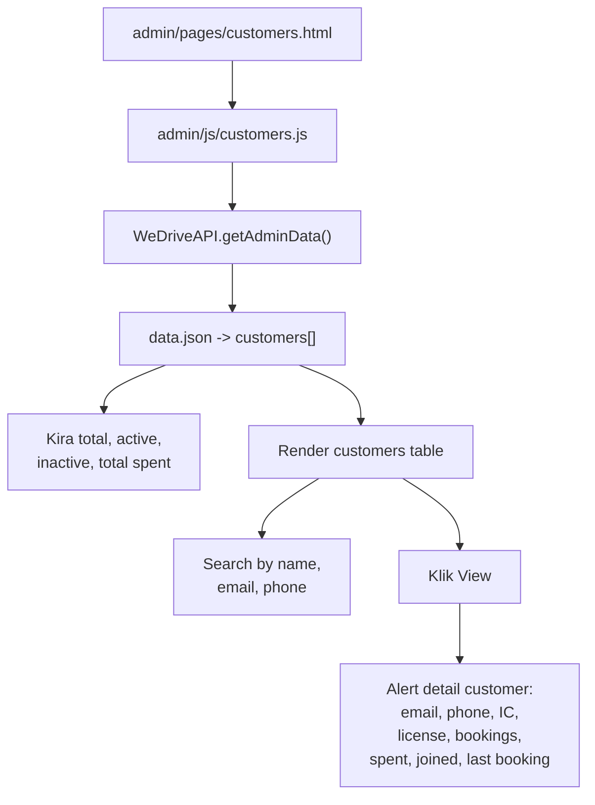
```mermaid
flowchart TD
    CUSTOMERS_PAGE["admin/pages/customers.html"] --> CUSTOMERS_JS["admin/js/customers.js"]
    CUSTOMERS_JS --> LOAD_DATA["WeDriveAPI.getAdminData()"]
    LOAD_DATA --> CUSTOMERS_DATA["data.json -> customers[]"]

    CUSTOMERS_DATA --> STATS["Kira total, active,<br/>inactive, total spent"]
    CUSTOMERS_DATA --> TABLE["Render customers table"]

    TABLE --> SEARCH["Search by name,<br/>email, phone"]
    TABLE --> VIEW["Klik View"]
    VIEW --> ALERT_CUSTOMER["Alert detail customer:<br/>email, phone, IC,<br/>license, bookings,<br/>spent, joined, last booking"]
```

## 11. Admin Reports Flow

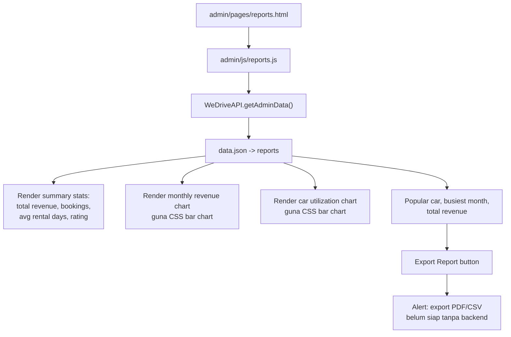
```mermaid
flowchart TD
    REPORTS_PAGE["admin/pages/reports.html"] --> REPORTS_JS["admin/js/reports.js"]
    REPORTS_JS --> LOAD_DATA["WeDriveAPI.getAdminData()"]
    LOAD_DATA --> REPORTS_DATA["data.json -> reports"]

    REPORTS_DATA --> SUMMARY["Render summary stats:<br/>total revenue, bookings,<br/>avg rental days, rating"]
    REPORTS_DATA --> REVENUE_CHART["Render monthly revenue chart<br/>guna CSS bar chart"]
    REPORTS_DATA --> UTIL_CHART["Render car utilization chart<br/>guna CSS bar chart"]
    REPORTS_DATA --> SUMMARY_CARDS["Popular car, busiest month,<br/>total revenue"]

    SUMMARY_CARDS --> EXPORT["Export Report button"]
    EXPORT --> DEMO_EXPORT["Alert: export PDF/CSV<br/>belum siap tanpa backend"]
```

## 12. Admin Marketing Flow

Marketing ialah antara modul yang boleh persist secara local melalui `localStorage`.

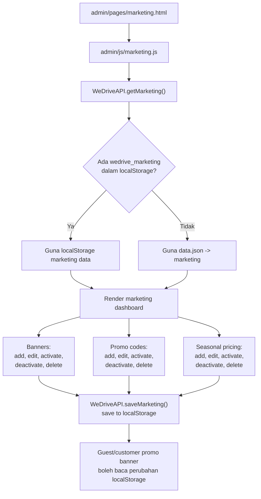
```mermaid
flowchart TD
    MARKETING_PAGE["admin/pages/marketing.html"] --> MARKETING_JS["admin/js/marketing.js"]
    MARKETING_JS --> GET_MARKETING["WeDriveAPI.getMarketing()"]

    GET_MARKETING --> CHECK_STORAGE{"Ada wedrive_marketing<br/>dalam localStorage?"}
    CHECK_STORAGE -->|Ya| USE_STORAGE["Guna localStorage marketing data"]
    CHECK_STORAGE -->|Tidak| USE_JSON["Guna data.json -> marketing"]

    USE_STORAGE --> RENDER_MARKETING["Render marketing dashboard"]
    USE_JSON --> RENDER_MARKETING

    RENDER_MARKETING --> BANNERS["Banners:<br/>add, edit, activate,<br/>deactivate, delete"]
    RENDER_MARKETING --> PROMOS["Promo codes:<br/>add, edit, activate,<br/>deactivate, delete"]
    RENDER_MARKETING --> SEASONAL["Seasonal pricing:<br/>add, edit, activate,<br/>deactivate, delete"]

    BANNERS --> SAVE_STORAGE["WeDriveAPI.saveMarketing()<br/>save to localStorage"]
    PROMOS --> SAVE_STORAGE
    SEASONAL --> SAVE_STORAGE

    SAVE_STORAGE --> GUEST_PROMO["Guest/customer promo banner<br/>boleh baca perubahan localStorage"]
```

## 13. Admin Calendar Overview Flow

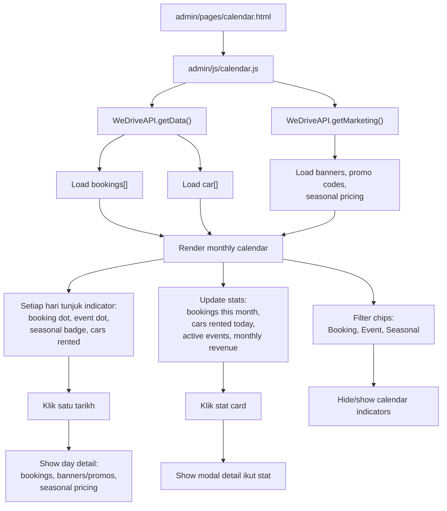
```mermaid
flowchart TD
    CAL_PAGE["admin/pages/calendar.html"] --> CAL_JS["admin/js/calendar.js"]
    CAL_JS --> GET_DATA["WeDriveAPI.getData()"]
    CAL_JS --> GET_MARKETING["WeDriveAPI.getMarketing()"]

    GET_DATA --> BOOKINGS["Load bookings[]"]
    GET_DATA --> CAR["Load car[]"]
    GET_MARKETING --> MARKETING["Load banners, promo codes,<br/>seasonal pricing"]

    BOOKINGS --> RENDER_CAL["Render monthly calendar"]
    CAR --> RENDER_CAL
    MARKETING --> RENDER_CAL

    RENDER_CAL --> DAY_CELL["Setiap hari tunjuk indicator:<br/>booking dot, event dot,<br/>seasonal badge, cars rented"]
    RENDER_CAL --> STATS["Update stats:<br/>bookings this month,<br/>cars rented today,<br/>active events, monthly revenue"]

    DAY_CELL --> CLICK_DAY["Klik satu tarikh"]
    CLICK_DAY --> DETAIL_PANEL["Show day detail:<br/>bookings, banners/promos,<br/>seasonal pricing"]

    STATS --> CLICK_STAT["Klik stat card"]
    CLICK_STAT --> MODAL["Show modal detail ikut stat"]

    RENDER_CAL --> FILTERS["Filter chips:<br/>Booking, Event, Seasonal"]
    FILTERS --> HIDE_SHOW["Hide/show calendar indicators"]
```

## 14. Admin Settings Flow

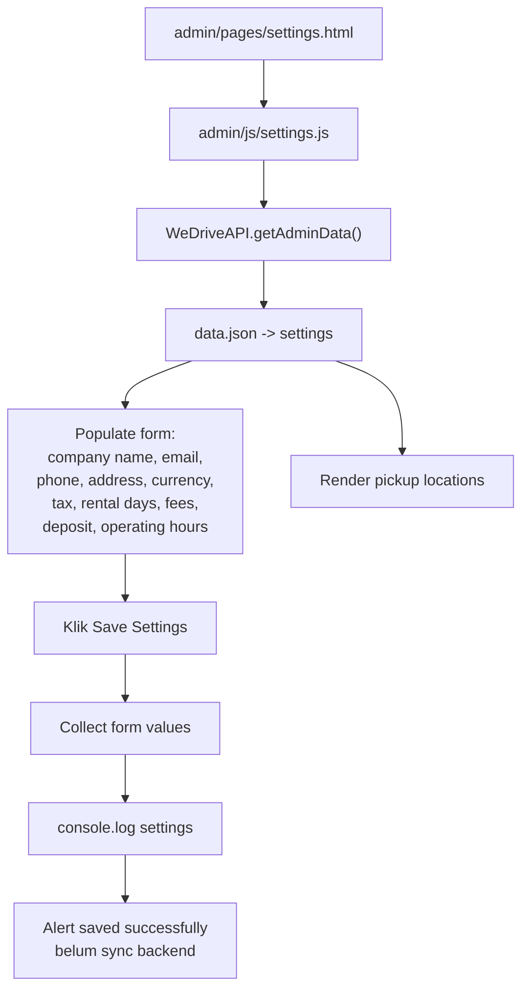
```mermaid
flowchart TD
    SETTINGS_PAGE["admin/pages/settings.html"] --> SETTINGS_JS["admin/js/settings.js"]
    SETTINGS_JS --> LOAD_DATA["WeDriveAPI.getAdminData()"]
    LOAD_DATA --> SETTINGS_DATA["data.json -> settings"]

    SETTINGS_DATA --> FORM["Populate form:<br/>company name, email,<br/>phone, address, currency,<br/>tax, rental days, fees,<br/>deposit, operating hours"]
    SETTINGS_DATA --> LOCATIONS["Render pickup locations"]

    FORM --> SAVE["Klik Save Settings"]
    SAVE --> COLLECT["Collect form values"]
    COLLECT --> CONSOLE["console.log settings"]
    CONSOLE --> ALERT["Alert saved successfully<br/>belum sync backend"]
```

## 15. Chatbot Flow

### 15.1 Customer/Guest Chatbot

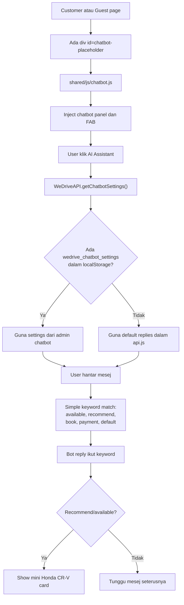
```mermaid
flowchart TD
    PAGE["Customer atau Guest page"] --> PLACEHOLDER["Ada div id=chatbot-placeholder"]
    PLACEHOLDER --> CHATBOT_JS["shared/js/chatbot.js"]
    CHATBOT_JS --> INJECT_UI["Inject chatbot panel dan FAB"]
    INJECT_UI --> USER_OPEN["User klik AI Assistant"]
    USER_OPEN --> GET_SETTINGS["WeDriveAPI.getChatbotSettings()"]

    GET_SETTINGS --> CHECK_LOCAL{"Ada wedrive_chatbot_settings<br/>dalam localStorage?"}
    CHECK_LOCAL -->|Ya| USE_ADMIN_SETTINGS["Guna settings dari admin chatbot"]
    CHECK_LOCAL -->|Tidak| DEFAULT_REPLY["Guna default replies dalam api.js"]

    USE_ADMIN_SETTINGS --> USER_MSG["User hantar mesej"]
    DEFAULT_REPLY --> USER_MSG

    USER_MSG --> RULE_MATCH["Simple keyword match:<br/>available, recommend,<br/>book, payment, default"]
    RULE_MATCH --> BOT_REPLY["Bot reply ikut keyword"]
    BOT_REPLY --> MINI_CARD{"Recommend/available?"}
    MINI_CARD -->|Ya| SHOW_CAR_CARD["Show mini Honda CR-V card"]
    MINI_CARD -->|Tidak| END_CHAT["Tunggu mesej seterusnya"]
```

### 15.2 Admin AI Chatbot Settings

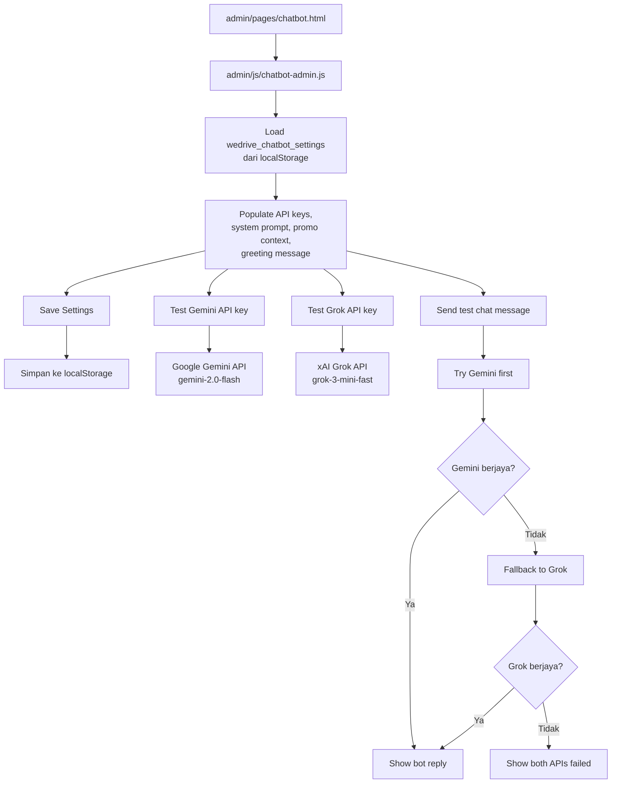
```mermaid
flowchart TD
    CHATBOT_ADMIN["admin/pages/chatbot.html"] --> CHATBOT_ADMIN_JS["admin/js/chatbot-admin.js"]
    CHATBOT_ADMIN_JS --> LOAD_SETTINGS["Load wedrive_chatbot_settings<br/>dari localStorage"]
    LOAD_SETTINGS --> FORM["Populate API keys,<br/>system prompt, promo context,<br/>greeting message"]

    FORM --> SAVE_SETTINGS["Save Settings"]
    SAVE_SETTINGS --> LOCAL_STORAGE["Simpan ke localStorage"]

    FORM --> TEST_GEMINI["Test Gemini API key"]
    FORM --> TEST_GROK["Test Grok API key"]
    FORM --> TEST_CHAT["Send test chat message"]

    TEST_GEMINI --> GEMINI_API["Google Gemini API<br/>gemini-2.0-flash"]
    TEST_GROK --> GROK_API["xAI Grok API<br/>grok-3-mini-fast"]

    TEST_CHAT --> TRY_GEMINI["Try Gemini first"]
    TRY_GEMINI --> GEMINI_OK{"Gemini berjaya?"}
    GEMINI_OK -->|Ya| SHOW_REPLY["Show bot reply"]
    GEMINI_OK -->|Tidak| TRY_GROK["Fallback to Grok"]
    TRY_GROK --> GROK_OK{"Grok berjaya?"}
    GROK_OK -->|Ya| SHOW_REPLY
    GROK_OK -->|Tidak| SHOW_FAIL["Show both APIs failed"]
```

## 16. Shared Components, Theme, Language dan Animation Flow

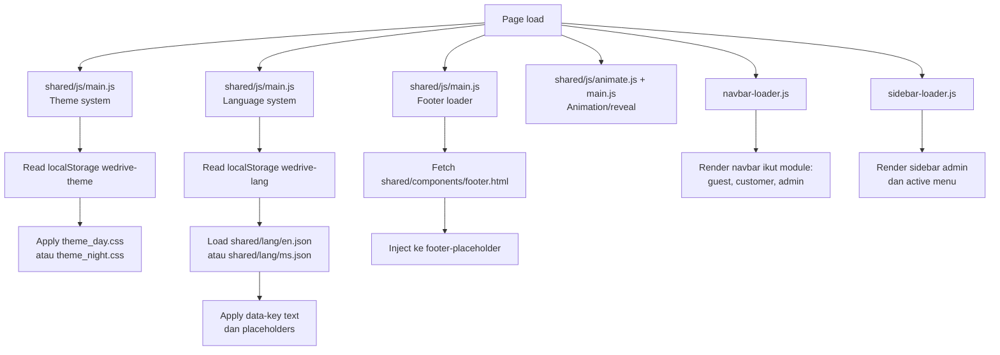
```mermaid
flowchart TD
    PAGE_LOAD["Page load"] --> THEME["shared/js/main.js<br/>Theme system"]
    PAGE_LOAD --> LANG["shared/js/main.js<br/>Language system"]
    PAGE_LOAD --> FOOTER["shared/js/main.js<br/>Footer loader"]
    PAGE_LOAD --> ANIMATE["shared/js/animate.js + main.js<br/>Animation/reveal"]

    THEME --> READ_THEME["Read localStorage wedrive-theme"]
    READ_THEME --> APPLY_CSS["Apply theme_day.css<br/>atau theme_night.css"]

    LANG --> READ_LANG["Read localStorage wedrive-lang"]
    READ_LANG --> LOAD_JSON["Load shared/lang/en.json<br/>atau shared/lang/ms.json"]
    LOAD_JSON --> APPLY_TEXT["Apply data-key text<br/>dan placeholders"]

    FOOTER --> FOOTER_HTML["Fetch shared/components/footer.html"]
    FOOTER_HTML --> INJECT_FOOTER["Inject ke footer-placeholder"]

    PAGE_LOAD --> NAVBAR["navbar-loader.js"]
    NAVBAR --> NAV_CONFIG["Render navbar ikut module:<br/>guest, customer, admin"]

    PAGE_LOAD --> SIDEBAR["sidebar-loader.js"]
    SIDEBAR --> ADMIN_ONLY["Render sidebar admin<br/>dan active menu"]
```

## 17. Database Integration Flow Masa Depan

Untuk connect database sebenar, idea asal sistem ialah tukar pusat API sahaja.

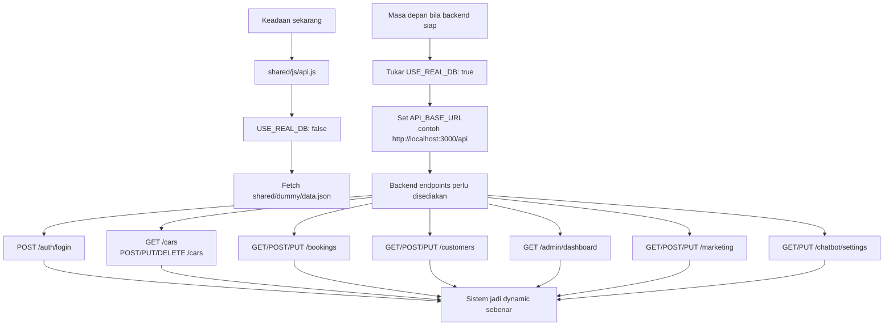
```mermaid
flowchart TD
    CURRENT["Keadaan sekarang"] --> API_CONFIG["shared/js/api.js"]
    API_CONFIG --> FLAG["USE_REAL_DB: false"]
    FLAG --> DUMMY["Fetch shared/dummy/data.json"]

    FUTURE["Masa depan bila backend siap"] --> CHANGE_FLAG["Tukar USE_REAL_DB: true"]
    CHANGE_FLAG --> SET_BASE["Set API_BASE_URL<br/>contoh http://localhost:3000/api"]
    SET_BASE --> BACKEND_ENDPOINTS["Backend endpoints perlu disediakan"]

    BACKEND_ENDPOINTS --> AUTH["POST /auth/login"]
    BACKEND_ENDPOINTS --> CARS["GET /cars<br/>POST/PUT/DELETE /cars"]
    BACKEND_ENDPOINTS --> BOOKINGS["GET/POST/PUT /bookings"]
    BACKEND_ENDPOINTS --> CUSTOMERS["GET/POST/PUT /customers"]
    BACKEND_ENDPOINTS --> DASHBOARD["GET /admin/dashboard"]
    BACKEND_ENDPOINTS --> MARKETING["GET/POST/PUT /marketing"]
    BACKEND_ENDPOINTS --> CHATBOT["GET/PUT /chatbot/settings"]

    AUTH --> REAL_SYSTEM["Sistem jadi dynamic sebenar"]
    CARS --> REAL_SYSTEM
    BOOKINGS --> REAL_SYSTEM
    CUSTOMERS --> REAL_SYSTEM
    DASHBOARD --> REAL_SYSTEM
    MARKETING --> REAL_SYSTEM
    CHATBOT --> REAL_SYSTEM
```

## 18. Status Fungsi Semasa

| Bahagian | Status semasa |
|---|---|
| Login | Demo login. Email ada `admin` jadi admin, selain itu customer |
| Signup | Demo sahaja. Tidak create user dalam database |
| Auth guard | Ada code, tapi `AUTH_GUARD_ACTIVE = false` |
| Customer browse cars | Berfungsi baca `car[]` dari dummy JSON |
| Customer booking | Demo alert sahaja, belum create booking |
| Guest browse cars | Berfungsi, tetapi booking perlu redirect login |
| Admin dashboard | Berfungsi baca stats dan car |
| Admin cars | Berfungsi untuk view, filter, search |
| Add car | Demo alert sahaja |
| Edit car detail | Update paparan semasa sahaja, tidak persist ke JSON |
| Delete car | Demo toast dan redirect sahaja |
| Booking calendar car detail | Boleh pilih range dan kira total, tapi booking baru tidak disimpan |
| Admin bookings | View, filter, search booking dummy |
| Admin customers | View dan search customer dummy |
| Admin reports | Render report chart guna data dummy |
| Admin settings | Populate form dan alert save, belum persist/backend |
| Marketing | Boleh persist ke `localStorage` |
| Promo banner | Baca marketing JSON/localStorage dan tunjuk active banner |
| Customer/guest chatbot | Rule-based keyword reply |
| Admin chatbot settings | Boleh test Gemini/Grok jika API key ada; settings simpan localStorage |

## 19. File Map Penting

| File/folder | Peranan |
|---|---|
| `index.html` | Login page dan entry point sistem |
| `guest/pages/guest.html` | Guest browsing page |
| `customer/pages/signup.html` | Signup demo |
| `customer/pages/customer.html` | Customer dashboard |
| `customer/js/customer.js` | Render cars, filter cars, demo booking |
| `admin/pages/admin.html` | Admin dashboard |
| `admin/js/admin.js` | Populate admin stats dan car table |
| `admin/pages/cars.html` | Cars/car management page |
| `admin/js/cars.js` | Cars stats, cards, list modal, filter, search |
| `admin/pages/car-detail.html` | Detail satu kereta |
| `admin/js/car-detail.js` | Render detail, images, booking history, booking calendar |
| `admin/pages/bookings.html` | Booking management page |
| `admin/js/bookings.js` | Render/filter/search bookings |
| `admin/pages/customers.html` | Customer management page |
| `admin/js/customers.js` | Render/search customer list |
| `admin/pages/reports.html` | Report and analytics page |
| `admin/js/reports.js` | Revenue chart dan utilization chart |
| `admin/pages/marketing.html` | Marketing management page |
| `admin/js/marketing.js` | Banner, promo code, seasonal pricing |
| `admin/pages/calendar.html` | Calendar overview page |
| `admin/js/calendar.js` | Monthly calendar, booking/event/seasonal indicators |
| `admin/pages/settings.html` | System settings page |
| `admin/js/settings.js` | Populate settings form |
| `admin/pages/chatbot.html` | AI chatbot admin settings |
| `admin/js/chatbot-admin.js` | Gemini/Grok key test dan test chat |
| `shared/js/api.js` | Pusat data/API semua page |
| `shared/dummy/data.json` | Dummy database utama |
| `shared/js/main.js` | Theme, language, animation, footer loader |
| `shared/js/navbar-loader.js` | Load navbar ikut guest/customer/admin |
| `shared/js/sidebar-loader.js` | Load sidebar admin |
| `shared/js/chatbot.js` | Reusable customer/guest chatbot |
| `shared/js/promo-banner.js` | Promo banner display |

## 20. Ringkasan Mudah

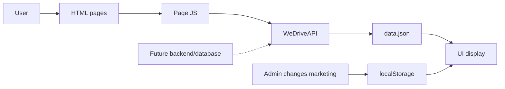
```mermaid
flowchart LR
    USER["User"] --> HTML["HTML pages"]
    HTML --> JS["Page JS"]
    JS --> API["WeDriveAPI"]
    API --> JSON["data.json"]
    JSON --> UI["UI display"]

    ADMIN["Admin changes marketing"] --> LOCAL["localStorage"]
    LOCAL --> UI

    FUTURE_DB["Future backend/database"] -.-> API
```

Kesimpulan: sistem ini ialah frontend prototype yang sudah lengkap untuk tunjuk flow FYP. Semua page utama sudah ada, data dummy sudah tersusun, dan `api.js` sudah disediakan sebagai tempat utama untuk sambung database sebenar nanti.
